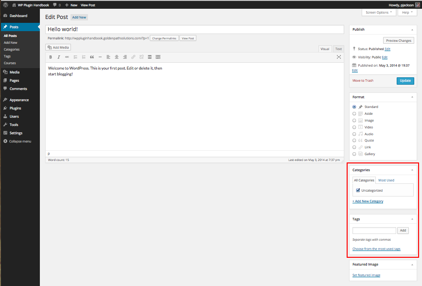
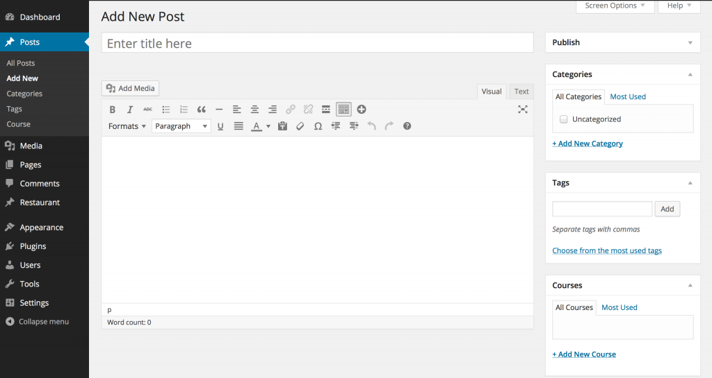

## [Custom Taxonomies](https://developer.wordpress.org/plugins/taxonomies/working-with-custom-taxonomies/#custom-taxonomies)

As classification systems go, “Categories” and “Tags” aren’t very structured, so it may be beneficial for a developer to create their own.

就分类系统而言，"类别 "和 "标签 "的结构并不严谨，因此开发人员创建自己的分类系统可能会有所帮助。

WordPress allows developers to create **Custom Taxonomies**. Custom Taxonomies are useful when one wants to create distinct naming systems and make them accessible behind the scenes in a predictable way.

WordPress 允许开发人员创建自定义分类。如果想要创建不同的命名系统，并以可预测的方式在幕后对其进行访问，自定义分类就非常有用。


## [Why Use Custom Taxonomies?](https://developer.wordpress.org/plugins/taxonomies/working-with-custom-taxonomies/#why-use-custom-taxonomies)

You might ask, “Why bother creating a Custom Taxonomy, when I can organize by Categories and Tags?”

你可能会问："既然我可以按类别和标签进行组织，为什么还要创建自定义分类方法呢？

Well… let’s use an example. Suppose we have a client that is a chef who wants you to create a website where she’ll feature original recipes.

好吧......让我们举个例子。假设我们有一个厨师客户，她希望你创建一个网站，介绍她的原创菜谱。

One way to organize the website might be to create a Custom Post Type called “Recipes” to store her recipes. Then create a Taxonomy “Courses” to separate “Appetizers” from “Desserts”, and finally a Taxonomy “Ingredients” to separate “Chicken” from “Chocolate” dishes.

一种组织网站的方法是创建一个名为 "食谱 "的自定义帖子类型来存储她的食谱。然后创建分类 "课程"，将 "开胃菜 "和 "甜点 "分开，最后创建分类 "成分"，将 "鸡肉 "和 "巧克力 "分开。

These groups *could* be defined using Categories or Tags, you could have a “Courses” Category with Subcategories for “Appetizers” and “Desserts”, and an “Ingredients” Category with Subcategories for each ingredient.

这些组可以使用类别或标签来定义，您可以为 "开胃菜 "和 "甜点 "创建一个 "课程 "子类别，为每种配料创建一个"配料"子类别。

The main advantage of using Custom Taxonomies is that you can reference “Courses” and “Ingredients” independently of Categories and Tags. They even get their own menus in the Administration area.

使用自定义分类的主要优势在于，您可以独立于类别和标签来引用 "课程 "和 "配料"。它们甚至可以在管理区获得自己的菜单。

In addition, creating Custom Taxonomies allows you to build custom interfaces which will ease the life of your client and make the process of inserting data intuitive to their business nature.

此外，创建自定义分类还可以建立自定义界面，从而方便客户的生活，并使插入数据的过程直观地反映客户的业务性质。

Now imagine that these Custom Taxonomies and the interface is implemented inside a plugin; you’ve just built your own Recipes plugin that can be reused on any WordPress website.

现在想象一下，这些自定义分类和界面是在一个插件中实现的；您刚刚创建了自己的食谱插件，可以在任何 WordPress 网站上重复使用。


## [Example: Courses Taxonomy](https://developer.wordpress.org/plugins/taxonomies/working-with-custom-taxonomies/#example-courses-taxonomy)

The following example will show you how to create a plugin which adds a Custom Taxonomy “Courses” to the default `post` Post Type. Note that the code to add custom taxonomies does not have to be in its own plugin; it can be included in a theme or as part of an existing plugin if desired.

下面的示例将向您展示如何创建一个插件，在默认帖子类型中添加自定义分类 "课程"。请注意，添加自定义分类标准的代码不一定要放在自己的插件中；如果需要，也可以放在主题中或作为现有插件的一部分。

Please make sure to read the [Plugin Basics](https://developer.wordpress.org/plugin/the-basics/) chapter before attempting to create your own plugin.

在尝试创建自己的插件之前，请务必阅读插件基础知识章节。


### [Step 1: Before You Begin](https://developer.wordpress.org/plugins/taxonomies/working-with-custom-taxonomies/#step-1-before-you-begin)

Go to **Posts > Add New** page. You will notice that you only have Categories and Tags.




### [Step 2: Creating a New Plugin](https://developer.wordpress.org/plugins/taxonomies/working-with-custom-taxonomies/#step-2-creating-a-new-plugin)

Register the Taxonomy “course” for the post type “post” using the `init` action hook.

使用 init 操作钩子为"post"帖子类型注册"课程"分类。

```php
/*
* Plugin Name: Course Taxonomy
* Description: A short example showing how to add a taxonomy called Course.
* Version: 1.0
* Author: developer.wordpress.org
* Author URI: https://codex.wordpress.org/User:Aternus
*/

function wporg_register_taxonomy_course() {
	 $labels = array(
		 'name'              => _x( 'Courses', 'taxonomy general name' ),
		 'singular_name'     => _x( 'Course', 'taxonomy singular name' ),
		 'search_items'      => __( 'Search Courses' ),
		 'all_items'         => __( 'All Courses' ),
		 'parent_item'       => __( 'Parent Course' ),
		 'parent_item_colon' => __( 'Parent Course:' ),
		 'edit_item'         => __( 'Edit Course' ),
		 'update_item'       => __( 'Update Course' ),
		 'add_new_item'      => __( 'Add New Course' ),
		 'new_item_name'     => __( 'New Course Name' ),
		 'menu_name'         => __( 'Course' ),
	 );
	 $args   = array(
		 'hierarchical'      => true, // make it hierarchical (like categories)
		 'labels'            => $labels,
		 'show_ui'           => true,
		 'show_admin_column' => true,
		 'query_var'         => true,
		 'rewrite'           => [ 'slug' => 'course' ],
	 );
	 register_taxonomy( 'course', [ 'post' ], $args );
}
add_action( 'init', 'wporg_register_taxonomy_course' );
```


### [Step 3: Review the Result](https://developer.wordpress.org/plugins/taxonomies/working-with-custom-taxonomies/#step-3-review-the-result)

Activate your plugin, then go to **Posts > Add New**. You should see a new meta box for your “Courses” Taxonomy.




### [Code Breakdown](https://developer.wordpress.org/plugins/taxonomies/working-with-custom-taxonomies/#code-breakdown)

The following discussion breaks down the code used above describing the functions and parameters.

下面的讨论将对上面使用的代码进行细分，对函数和参数进行描述。

The function `wporg_register_taxonomy_course` contains all the steps necessary for registering a Custom Taxonomy.

函数 wporg_register_taxonomy_course 包含注册自定义分类的所有必要步骤。

The `$labels` array holds the labels for the Custom Taxonomy.

$labels 数组用于保存自定义分类的标签。

These labels will be used for displaying various information about the Taxonomy in the Administration area.
这些标签将用于在管理区显示有关分类标各种信息。

The `$args` array holds the configuration options that will be used when creating our Custom Taxonomy.

$args 数组包含创建自定义分类时使用的配置选项。

The function [register_taxonomy()](https://developer.wordpress.org/reference/functions/register_taxonomy/) creates a new Taxonomy with the identifier `course` for the `post` Post Type using the `$args` array for configuration.

函数 register_taxonomy() 使用 $args 数组作为配置，为帖子类型创建一个course分类。

The function [add_action()](https://developer.wordpress.org/reference/functions/add_action/) ties the `wporg_register_taxonomy_course` function execution to the `init` action hook.

函数 add_action() 将 wporg_register_taxonomy_course 函数的执行与 init 操作钩子联系起来。


#### [$args](https://developer.wordpress.org/plugins/taxonomies/working-with-custom-taxonomies/#args)

The $args array holds important configuration for the Custom Taxonomy, it instructs WordPress how the Taxonomy should work.

Take a look at [register_taxonomy()](https://developer.wordpress.org/reference/functions/register_taxonomy/) function for a full list of accepted parameters and what each of these do.


### [Summary](https://developer.wordpress.org/plugins/taxonomies/working-with-custom-taxonomies/#summary)

With our Courses Taxonomy example, WordPress will automatically create an archive page and child pages for the `course` Taxonomy.

The archive page will be at `/course/` with child pages spawning under it using the Term’s slug (`/course/%%term-slug%%/`).


## [Using Your Taxonomy](https://developer.wordpress.org/plugins/taxonomies/working-with-custom-taxonomies/#using-your-taxonomy)

WordPress has **many** functions for interacting with your Custom Taxonomy and the Terms within it.

Here are some examples:

- `the_terms`: Takes a Taxonomy argument and renders the terms in a list.
- `wp_tag_cloud`: Takes a Taxonomy argument and renders a tag cloud of the terms.
- `is_taxonomy`: Allows you to determine if a given taxonomy exists.


