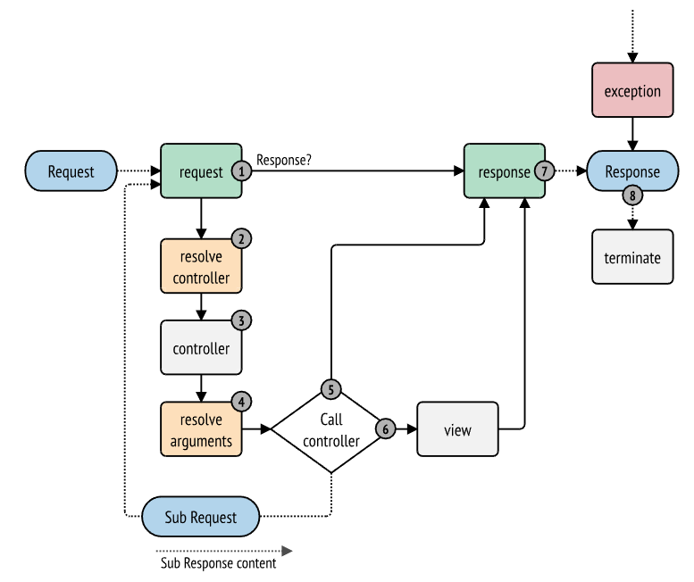

## The HttpKernel Component

HttpKernel组件通过利用EventDispatcher组件提供了一个将请求转换为响应的结构化流程。HttpKernel是足够灵活的，足以创建一个全栈框架（Symfony），或一个微服务框架（Silex）或者一个高级的CMS系统（Drupal）。


### Installation

```
$ composer require symfony/http-kernel
```

如果你在Symfony应用之外安装该组件，你的代码中必须要require vendor/autoload.php文件，以去启用composer提供的类自动加载机制。阅读这篇文章（[this article](https://symfony.com/doc/5.4/components/using_components.html)）以了解更多内容。


### The Workflow of a Request

链接：这篇文章解释了如何在任意的PHP应用程序中使用HttpKernel功能作为一个独立的组件。在Symfony应用程序中，一切都已经配置完毕，可以直接使用。阅读控制器（[Controller](https://symfony.com/doc/5.4/controller.html) ）和事件以及事件监听器（[Events and Event Listeners](https://symfony.com/doc/5.4/event_dispatcher.html) ），了解如何使用HttpKernel在Symfony应用程序中创建控制器和定义事件。

每一个HTTP web交互都以一个请求开始，以一个响应结束。作为一个开发者，你的工作是编写PHP代码，读取请求信息（如URL），创建并返回响应（如HTML页面或JSON字符串）。以下Symfony应用程序中请求工作流程的一个简单预览：

1. 用户在浏览器中请求一个资源
2. 浏览器发送请求到服务器
3. Symfony会给与应用一个Request对象。
4. 应用程序会使用Request对象的数据来生成一个Response对象
5. 服务端会返回一个响应给浏览器。
6. 浏览器显示资源给用户

通常会创建某种框架或系统来处理所有的重复性任务（如路由、安全等），以便开发人员能够建立应用程序的每个页面。HttpKernel组件提供了一个接口，将从请求开始并创建响应的过程给固化。这个组件是为了成为任何应用程序或框架的核心，无论该系统的架构如何变化。

```php
namespace Symfony\Component\HttpKernel;

use Symfony\Component\HttpFoundation\Request;

interface HttpKernelInterface
{
    // ...

    /**
     * @return Response A Response instance
     */
    public function handle(
        Request $request,
        int $type = self::MAIN_REQUEST,
        bool $catch = true
    );
}
```

在内部，HttpKernel::handle()是HttpKernelInterface::handle()的具体实现，而HttpKernelInterface::handle()接口定义了一个工作流程，以一个Request开始，以一个Response结束。


整个工作流的实现细节是理解内核（以及Symfony框架或任何其他使用该内核的库）如何工作的关键。


### HttpKernel: Driven by Events

HttpKernel::handle()方法在内部通过调度事件（dispatching events）来工作。这使得该方法既灵活又有点抽象，因为用HttpKernel构建的框架/应用程序的所有 "工作 "实际上是在事件监听器中完成的。

为了帮助解释这个过程，本文档研究了整个过程中的每一步，并讨论了HttpKernel的一个具体实现 - 即Symfony框架是如何工作的。

最初，使用HttpKernel不需要很多步骤。你创建了一个事件分发器（[event dispatcher](https://symfony.com/doc/5.4/components/event_dispatcher.html) ）和一个控制器解析器以及参数解析器（[controller and argument resolver](https://symfony.com/doc/5.4/components/http_kernel.html#component-http-kernel-resolve-controller) ）。为了完成你的内核工作，你将为下面讨论的事件添加更多的事件监听器：

```php
use Symfony\Component\EventDispatcher\EventDispatcher;
use Symfony\Component\HttpFoundation\Request;
use Symfony\Component\HttpFoundation\RequestStack;
use Symfony\Component\HttpKernel\Controller\ArgumentResolver;
use Symfony\Component\HttpKernel\Controller\ControllerResolver;
use Symfony\Component\HttpKernel\HttpKernel;

// create the Request object
$request = Request::createFromGlobals();

$dispatcher = new EventDispatcher();
// ... add some event listeners

// create your controller and argument resolvers
$controllerResolver = new ControllerResolver();
$argumentResolver = new ArgumentResolver();

// instantiate the kernel
$kernel = new HttpKernel($dispatcher, $controllerResolver, new RequestStack(), $argumentResolver);

// actually execute the kernel, which turns the request into a response
// by dispatching events, calling a controller, and returning the response
$response = $kernel->handle($request);

// send the headers and echo the content
$response->send();

// trigger the kernel.terminate event
$kernel->terminate($request, $response);
```

查看 "[The HttpKernel Component](https://symfony.com/doc/5.4/components/http_kernel.html#http-kernel-working-example)"以获得更多具体实现。

警告：从3.1开始，HttpKernel接受第四个参数，它必须是一个ArgumentResolverInterface的实例。在4.0中，这个参数将成为强制性的。

链接：有一个关于使用HttpKernel组件和其他Symfony组件来创建自己的框架的精彩教程系列。查看[Introduction](https://symfony.com/doc/5.4/create_framework/introduction.html).


#### 1)The kernel.request Event

典型应用：为请求添加更多信息，初始化系统的某些部分，或者在可能的情况下返回一个响应（例如拒绝访问的安全层）。

在HttpKernel::handle中第一个被分发的事件是kernel.request，该事件可能会有各种不同的监听器。

该事件的监听器是多样的，某些监听器 - 比如security监听器可能有足够的信息立刻创建一个Response对象。例如，如果一个security监听器确定用户不能进行访问，该监听器可能返回一个RedirectResponse到登陆页面，或者是一个403拒绝访问的响应。

在该阶段返回Response对象，处理会直接跳到kernel.response事件。

其他一些监听器会做一些初始化的工作或者添加更新信息到请求中。

例如某个监听器可能会确定并设置Request对象的语言环境。另外一个常见的监听器是路由（routing）。一个路由监听器可能会处理Request并确定应被呈现的控制器。实际上，Request对象有一个属性包（attributes bag），它是一个存储关于请求额外的、特定于应用程序的数据的地方。这意味着，如果你的路由器监听器以某种方式确定了控制器，它可以将其存储在Request属性上（可以被你的控制器解析器使用）。

总的来说，kernel.request事件的目的是直接创建并返回一个Response，或者向Request添加信息（例如，设置locale或设置Request属性上的一些其他信息）。

注：当为kernel.request事件设置响应时，传播被停止。这意味着具有较低优先级的监听器不会被执行。


<b>kernel.request in the Symfony Framework</b>

在Symfony框架中，kernel.request最重要的监听器是[RouterListener](https://github.com/symfony/symfony/blob/5.4/src/Symfony/Component/HttpKernel/EventListener/RouterListener.php)。这个类执行路由层的一些处理，它返回一个关于匹配请求的信息数组，包括_controller和路由模式中的任何占位符（例如{slug}）。

该数组信息可能被存储在Request对象的attributes数组中。在这里添加的路由信息还未被使用到，但接下来在解析控制器时会用到。


#### 2)Resolve the Controller

假设没有kernel.request监听器创建Response，HttpKernel的下一步是确定和准备（即解析）控制器。控制器是终端应用的代码的一部分，负责创建和返回特定页面的响应。唯一的要求是它是PHP Callable，即一个函数，一个对象的方法或一个Closure。

但如何确定一个请求的控制器，完全取决于你的应用程序。这是 "控制器解析器 "的工作--一个实现 [ControllerResolverInterface](https://github.com/symfony/symfony/blob/5.4/src/Symfony/Component/HttpKernel/Controller/ControllerResolverInterface.php)的类，是HttpKernel的构造参数之一。

你的工作是创建一个实现该接口的类，并实现其方法：getController()。事实上，已经存在一个默认的实现，你可以直接使用或学习：[ControllerResolver](https://github.com/symfony/symfony/blob/5.4/src/Symfony/Component/HttpKernel/Controller/ControllerResolver.php)。这个实现在下面的侧边栏里有更多解释。

```php
namespace Symfony\Component\HttpKernel\Controller;

use Symfony\Component\HttpFoundation\Request;

interface ControllerResolverInterface
{
    public function getController(Request $request);
}
```

在内部，HttpKernel::handle()方法首先调用控制器解析器的getController()。该方法会被传递一个Request对象，并负责基于请求的信息以某种方式确定和返回PHP Callback（控制器）。


<b>Resolving the Controller in the Symfony Framework</b>

Symfony框架使用内置的[ControllerResolver](https://github.com/symfony/symfony/blob/5.4/src/Symfony/Component/HttpKernel/Controller/ControllerResolver.php)类（实际上，它使用了一个子类，该子类具有下面提到的一些额外功能）。这个类会利用RouterListener期间放置在Request对象的attributes上的信息。

<b>getController</b>

ControllerResolver会在Request对象的attributes属性上寻找一个\_controller Key（回顾一下，这些信息通常是通过RouterListener放在Request上的）。然后通过执行以下操作将此字符串转换为 PHP callable：

1. 如果_controller键没有遵循推荐的PHP命名空间格式（例如App\Controller\DefaultController::index），那么将会转换它的格式。

   例如，FooBundle:Default:index会被改变为Acme\FooBundle\Controller\DefaultController::indexAction。左边是传统的格式，右边的这种格式转换是针对Symfony框架使用的ControllerResolver子类的。

2. 该控制器类会被实例化出一个新的对象，但是不携带任何构造参数。

3. 如果控制器实现了 [ContainerAwareInterface](https://github.com/symfony/symfony/blob/5.4/src/Symfony/Component/DependencyInjection/ContainerAwareInterface.php)，setContainer()方法会在控制器上被调用，并把容器容器对象传递给它。此步骤也特定于Symfony框架使用的ControllerResolver子类。


#### 3)The kernel.controller Event

典型用途：在控制器执行之前做些初始化工作或者改变控制器。

在控制器callable确定后，HttpKernel::handle()会分发kernel.controller事件。这个事件的监听器可能会在某些事情确定后（如控制器，路由信息），但在控制器执行前，初始化一部分系统需要初始化的东西。关于一些例子，请看下面的Symfony部分。

此事件监听器还可以通过传递给此事件监听器的事件对象，通过调用ControllerEvent::setController来完全更改可调用的控制器。

<b>kernel.controller in the Symfony Framework</b>

在Symfony框架中，kernel.controller事件有一些次要监听器，当profiler启用时会有许多监听器用于收集profiler需要的分析数据。

一个有趣的监听器来自SensioFrameworkExtraBundle。这个监听器的@ParamConverter功能允许你传递一个完整的对象（例如Post对象）给你的控制器，而不是一个标量值（例如你的路由中的id参数）。监听器--ParamConverterListener--使用反射来查看控制器的每个参数，并尝试使用不同的方法将这些参数转换为对象，然后将其存储在Request对象的属性中。阅读下一节，看看为什么这很重要。


####  4)Getting the Controller Arguments

下一步HttpKernel::handle()会调用 [ArgumentResolverInterface::getArguments()](https://github.com/symfony/symfony/blob/5.4/src/Symfony/Component/HttpKernel/Controller/ArgumentResolverInterface.php#method_getArguments)。记住，getController()返回的控制器是可调用的。getArguments()的目的是返回应该传递给该控制器的参数数组。具体怎么做完全取决于你的设计，尽管内置的ArgumentResolver是一个很好的例子。

在这一点上，kernel有一个PHP Callable（控制器）和一个执行该Callbale时应传递的参数数组。


<b>Getting the Controller Arguments in the Symfony Framework</b>

现在你已经知道了控制器callable（通常是控制器对象内的一个方法），ArgumentResolver会对callable使用反射来返回callable的参数名称数组，然后它遍历每个参数，并使用以下方式来确定每个参数应该传递哪个值：

1. 如果Request attributes bag包含匹配参数名的key，就会使用这个key的值。例如，如果控制器的第一个参数是$slug，并且在Request attributes bag中有一个slug键，那么这个值就会被使用（通常这个值来自RouterListener）。
2. 如果控制器中的参数是用Symfony的Request对象的类型提示，Request就会作为值被传入。
3. 如果函数或方法的参数是可变的，则Request attributes bag包含了一个参数数组，它们都可以通过可变参数获得。

此功能是由实现ArgumentValueResolverInterface的解析器提供。有四种实现提供了Symfony的默认行为，但在这里定制是关键。通过自己实现ArgumentValueResolverInterface并将其传递给ArgumentResolver，可以集成该功能。


####  5)Calling the Controller

HttpKernel::handle()的下一个步骤是执行控制器。

控制器的任务是去构建给定资源的响应。可能是一个html页面，一个JSON字符串或者其他东西。与流程中的其他部分不同，这一步是由 "终端开发者 "为每个建立的页面实现的。

通常控制器会返回一个Response对象。如果真的返回Response对象，内核的工作就完成了。在这种情况下，下个步骤是kernel.response事件。

但是如果控制器除了返回Response以外的任何东西，那么内核还有一点工作要做 - kernel.view（因为最终目标总是生成一个Response对象）。

提示：控制器必须有返回内容。如果一个控制器返回null，会直接抛出一个异常。


####  6)The kernel.view Event

典型作用：将控制器的非Response对象转换成Response对象。

如果控制器没有返回Response对象，内核会分发另外一个事件 - kernel.view。此事件的监听器的工作是使用控制器返回的值（比如对象或一个数组数组）去创建一个Response。

如果你想使用一个 "视图 "层，这可能很有用：你不是从控制器返回一个Response，而是返回代表页面的数据。这个事件的监听器可以使用这些数据来创建一个正确格式的Response（例如HTML、JSON等）。

在这个阶段，如果没有监听器在事件上设置一个响应，那么就会抛出一个异常：无论是控制器还是一个视图监听器都必须返回一个响应。

提示：当为kernel.view事件设置一个响应时，事件传播就会被停止。这意味着低优先级的监听器不会被执行。


<b>kernel.view in the Symfony Framework</b>

在Symfony框架中，kernel.view事件没有默认的监听器。然而，SensioFrameworkExtraBundle确实为这个事件添加了一个监听器。如果你的控制器返回一个数组，并且你把@Template注解放在控制器上面，那么这个监听器就会渲染一个模板，把你从控制器返回的数组传递给该模板，并创建一个包含该模板返回内容的响应。

此外，一个流行的社区包 [FOSRestBundle ](https://github.com/friendsofsymfony/FOSRestBundle)在这个事件上实现了一个监听器，旨在给你一个强大的视图层，能够使用一个控制器来返回许多不同的内容类型的响应（如HTML，JSON，XML，等等）。


#### 7)The kernel.response Event

典型用途：仅在响应之前修改Response对象。

内核的最终目标是将一个请求转化为一个响应。Response可能是在kernel.request事件中创建的，也可能是从控制器返回的，或者是由kernel.view事件的某个监听器返回的。

不管是谁创建了Response，另一个事件--kernel.response会在之后直接被派发。这个事件的典型监听器会以某种方式修改Response对象，比如修改headers，添加cookies，甚至改变Response本身的内容（比如在HTML响应的</body>标签结束前注入一些JavaScript）。

在这个事件被派发后，最终的Response对象会从handle()返回。在最典型的使用情况下，你可以调用send()方法，该方法发送头信息并打印Response内容。


<b>kernel.response in the Symfony Framework</b>

在Symfony框架内有几个关于这个事件的次要监听器，大多数都以某种方式修改响应。例如，[WebDebugToolbarListener](https://github.com/symfony/symfony/blob/5.4/src/Symfony/Bundle/WebProfilerBundle/EventListener/WebDebugToolbarListener.php)会在开发环境中的页面底部注入一些JavaScript，导致Web调试工具栏的显示。另一个监听器， [ContextListener](https://github.com/symfony/symfony/blob/5.4/src/Symfony/Component/Security/Http/Firewall/ContextListener.php)将当前用户的信息序列化到会话中，以便在下一次请求时可以重新加载。


####  8)The kernel.terminate Event

典型用途：在向用户发送响应后执行一些“繁重”操作。

HttpKernel进程的最后一个事件是kernel.terminate，它是独一无二的，因为它发生在HttpKernel::handle()方法之后，以及响应被发送给用户之后。回顾上面的内容，那么使用内核的代码，就像这样结束。

```php
// sends the headers and echoes the content
$response->send();

// triggers the kernel.terminate event
$kernel->terminate($request, $response);
```

正如你所看到的，通过在发送响应后调用$kernel->terminate，你将触发kernel.terminate事件，在这里你可以执行某些你可能已经延迟的动作，以便尽快将响应返回给客户端（例如发送电子邮件）。

警告：在内部，HttpKernel利用了fastcgi_finish_request的PHP函数。这意味着目前只有PHP FPM服务器API能够向客户端发送一个响应，而服务器的PHP进程仍然在执行某些任务。对于其他所有的服务器API，kernel.terminate 的监听器仍然被执行，但在它们全部完成之前，响应不会被发送到客户端。

提示：kernel.terminate事件是可选的，并且只有Kernel实现了[TerminableInterface](https://github.com/symfony/symfony/blob/5.4/src/Symfony/Component/HttpKernel/TerminableInterface.php)接口才应该被调用。

问题：假设一个PHP进程执行完fastcgi_finish_request后，它执行的任务耗时较长，在这个期间它是否能够继续接受其他请求呢？


### Handling Exceptions: the kernel.exception Event

典型应用：处理某类异常并针对该异常创建要给适当的Response对象。

如果在HttpKernel::handle()中的任意个阶段抛出了一个异常，就会抛出另一个事件--kernel.exception。在内部，handle()方法的主体被包裹在一个try-catch块中。当任何异常被抛出时，kernel.exception事件被派发，这样你的系统就可以以某种方式响应这个异常。


这个事件的每个监听器都被传递给一个ExceptionEvent对象，你可以通过getThrowable()方法访问原始的异常。该事件典型的监听器将会检查某种类型的异常并创建一个适当的错误响应。

例如去生成一个404页面，你可能会抛出一个特定类型的异常，然后在该事件的监听器上去寻找该异常，再创建并返回一个404响应。实际上，HttpKernel组件自带了一个 [ErrorListener](https://github.com/symfony/symfony/blob/5.4/src/Symfony/Component/HttpKernel/EventListener/ErrorListener.php)，如果您选择使用它，默认情况下会执行此操作以及更多的处理。

提示：当为kernel.exception事件设置响应时，传播被停止。这意味着优先级较低的监听器将不会被执行。


<b>kernel.exception in the Symfony Framework</b>

当使用Symfony框架时，kernel.exception事件有俩个主要的监听器。


<b>ErrorListener in the HttpKernel Component</b>

第一个是HttpKernel组件的核心，称为ErrorListener。该监听器有几个目标：

1. 抛出的异常被转换为一个FlattenException对象，它包含了所有关于请求的信息，但可以被打印和序列化。
2. 如果原始异常实现了HttpExceptionInterface，那么getStatusCode()和getHeaders()就会被调用，用来填充FlattenException对象的headers和状态码。这样做的目的是为了在下一步创建最终的响应时使用这些内容。如果你想设置自定义的HTTP头信息，你总是可以在派生自HttpException类的异常上使用setHeaders()方法。
3. 如果原始异常实现了RequestExceptionInterface，那么FlattenException对象的状态码就会被填充为400，其他头信息不会被修改。
4. 一个控制器被执行并传递给flattened exception。要渲染的确切控制器被作为构造参数传递给这个监听器。这个控制器将返回这个错误页面的最终响应。


<b>EexceptionListener in the Security Component</b>

另一个重要的监听器是ExceptionListener。这个监听器的目标是处理security 异常，并在适当的时候，帮助用户进行认证（例如，重定向到登录页面）。


### Creating an Event Listener

如你所见，你可以创建监听器到并将其并附加到HttpKernel::handle()运行过程中所派发的事件。通常情况下，监听器是一个带有被执行的方法的PHP类，但它可以是任何东西。关于创建和附加事件监听器的更多信息，请看[The EventDispatcher Component](https://symfony.com/doc/5.4/components/event_dispatcher.html)。

每个 "内核 "事件的名称被定义为[KernelEvents](https://github.com/symfony/symfony/blob/5.4/src/Symfony/Component/HttpKernel/KernelEvents.php)类的一个常量。此外，每个事件监听器被传递一个参数，它是[KernelEvent](https://github.com/symfony/symfony/blob/5.4/src/Symfony/Component/HttpKernel/Event/KernelEvent.php)的一些子类。这个对象包含了关于系统当前状态的信息，每个事件都有它们自己的事件对象。

| Name                        | `KernelEvents` Constant              | Argument passed to the listener                              |
| :-------------------------- | :----------------------------------- | :----------------------------------------------------------- |
| kernel.request              | `KernelEvents::REQUEST`              | [RequestEvent](https://github.com/symfony/symfony/blob/5.4/src/Symfony/Component/HttpKernel/Event/RequestEvent.php) |
| kernel.controller           | `KernelEvents::CONTROLLER`           | [ControllerEvent](https://github.com/symfony/symfony/blob/5.4/src/Symfony/Component/HttpKernel/Event/ControllerEvent.php) |
| kernel.controller_arguments | `KernelEvents::CONTROLLER_ARGUMENTS` | [ControllerArgumentsEvent](https://github.com/symfony/symfony/blob/5.4/src/Symfony/Component/HttpKernel/Event/ControllerArgumentsEvent.php) |
| kernel.view                 | `KernelEvents::VIEW`                 | [ViewEvent](https://github.com/symfony/symfony/blob/5.4/src/Symfony/Component/HttpKernel/Event/ViewEvent.php) |
| kernel.response             | `KernelEvents::RESPONSE`             | [ResponseEvent](https://github.com/symfony/symfony/blob/5.4/src/Symfony/Component/HttpKernel/Event/ResponseEvent.php) |
| kernel.finish_request       | `KernelEvents::FINISH_REQUEST`       | [FinishRequestEvent](https://github.com/symfony/symfony/blob/5.4/src/Symfony/Component/HttpKernel/Event/FinishRequestEvent.php) |
| kernel.terminate            | `KernelEvents::TERMINATE`            | [TerminateEvent](https://github.com/symfony/symfony/blob/5.4/src/Symfony/Component/HttpKernel/Event/TerminateEvent.php) |
| kernel.exception            | `KernelEvents::EXCEPTION`            | [ExceptionEvent](https://github.com/symfony/symfony/blob/5.4/src/Symfony/Component/HttpKernel/Event/ExceptionEvent.php) |


### A full Working Example

当使用HttpKernel组件时，你可以自由地将任何监听器附加到核心事件上，使用任何实现了ControllerResolverInterface的控制器解析器，并使用任何实现了ArgumentResolverInterface的参数解析器。然而，HttpKernel组件带有一些内置的监听器和其他一切，可以用来创建一个工作实例。

```php
use Symfony\Component\EventDispatcher\EventDispatcher;
use Symfony\Component\HttpFoundation\Request;
use Symfony\Component\HttpFoundation\RequestStack;
use Symfony\Component\HttpFoundation\Response;
use Symfony\Component\HttpKernel\Controller\ArgumentResolver;
use Symfony\Component\HttpKernel\Controller\ControllerResolver;
use Symfony\Component\HttpKernel\EventListener\RouterListener;
use Symfony\Component\HttpKernel\HttpKernel;
use Symfony\Component\Routing\Matcher\UrlMatcher;
use Symfony\Component\Routing\RequestContext;
use Symfony\Component\Routing\Route;
use Symfony\Component\Routing\RouteCollection;

$routes = new RouteCollection();
$routes->add('hello', new Route('/hello/{name}', [
    '_controller' => function (Request $request) {
        return new Response(
            sprintf("Hello %s", $request->get('name'))
        );
    }]
));

$request = Request::createFromGlobals();

$matcher = new UrlMatcher($routes, new RequestContext());

$dispatcher = new EventDispatcher();
$dispatcher->addSubscriber(new RouterListener($matcher, new RequestStack()));

$controllerResolver = new ControllerResolver();
$argumentResolver = new ArgumentResolver();

$kernel = new HttpKernel($dispatcher, $controllerResolver, new RequestStack(), $argumentResolver);

$response = $kernel->handle($request);
$response->send();

$kernel->terminate($request, $response);
```


### Sub Requests

除了被送入HttpKernel::handle()的 "主 "请求之外，你还可以发送一个所谓的 "子请求"。一个子请求的外观和行为与其他的请求一样，但通常只是为了渲染一个页面的一小部分，而不是一个完整的页面。你通常会从你的控制器中发出子请求（也可能是从一个模板中发出，由你的控制器渲染）。

要执行一个子请求，使用HttpKernel::handle()，但要把第二个参数改为如下：

```php
use Symfony\Component\HttpFoundation\Request;
use Symfony\Component\HttpKernel\HttpKernelInterface;

// ...

// create some other request manually as needed
$request = new Request();
// for example, possibly set its _controller manually
$request->attributes->set('_controller', '...');

$response = $kernel->handle($request, HttpKernelInterface::SUB_REQUEST);
// do something with this response
```

这就形成了另一个完整的请求-响应循环，这个新的请求被转化为一个响应。内部唯一的区别是，一些监听器（例如安全）可能只对主请求采取行动。每个监听器都会给其传递KernelEvent的一些子类，其isMainRequest()方法可以用来检查当前请求是 "主 "还是 "子 "请求。

例如，一个只需要对主请求采取行动的监听器可能看起来像这样：

```php
use Symfony\Component\HttpKernel\Event\RequestEvent;
// ...

public function onKernelRequest(RequestEvent $event)
{
    if (!$event->isMainRequest()) {
        return;
    }

    // ...
}
```


### Locating Resources

HttpKernel组件负责Symfony应用程序中使用的bundle机制。bundles的关键特性是它允许覆盖应用程序使用的任何资源（配置文件、模板、控制器、翻译文件等）。

这种覆盖机制之所以有效，是因为资源不是由其物理路径引用的，而是由其逻辑路径引用的。例如，存储在名为FooBundle的Resources/config/目录下的services.xml文件被引用为@FooBundle/Resources/config/services.xml。当应用程序覆盖该文件时，这个逻辑路径将起作用，即使你改变了FooBundle的目录。

HttpKernel组件提供了一个名为locateResource()的方法，可以用来将逻辑路径转化为物理路径。

```php
$path = $kernel->locateResource('@FooBundle/Resources/config/services.xml');
```


### Learn more

- [Built-in Symfony Events](https://symfony.com/doc/5.4/reference/events.html)