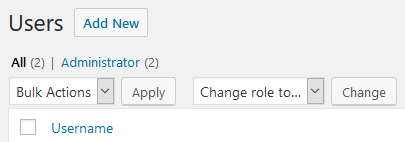

Roles and capabilities are two important aspects of WordPress that allow you to control user privileges.

角色和功能是 WordPress 的两个重要方面，可让您控制用户权限。

WordPress stores the Roles and their Capabilities in the `options` table under the `user_roles` key.

WordPress将角色及其功能存储在user_roles键下的选项表中。


## [Roles](https://developer.wordpress.org/plugins/users/roles-and-capabilities/#roles)

A role defines a set of capabilities for a user. For example, what the user may see and do in his dashboard.

一个角色定义了一个用户的功能集。例如用户在其后台面板可以看到并操作哪些功能。

**By default, WordPress have six roles:**

默认WorkPress有6个角色：

- Super Admin
- Administrator
- Editor
- Author
- Contributor
- Subscriber

More roles can be added and the default roles can be removed.

可以添加更多角色，也可以删除默认角色。




### [Adding Roles](https://developer.wordpress.org/plugins/users/roles-and-capabilities/#adding-roles)

Add new roles and assign capabilities to them with [add_role()](https://developer.wordpress.org/reference/functions/add_role/) .

使用 add_role() 添加新角色并为其分配功能。

```php
function wporg_simple_role() {
	add_role(
		'simple_role',
		'Simple Role',
		array(
			'read'         => true,
			'edit_posts'   => true,
			'upload_files' => true,
		),
	);
}

// Add the simple_role.
add_action( 'init', 'wporg_simple_role' );
```

> Alert: After the first call to [add_role()](https://developer.wordpress.org/reference/functions/add_role/) , the Role and it’s Capabilities will be stored in the database!
>
> 第一次调用 add_role() 后，角色及功能将被存储在数据库中！
>
> Sequential calls will do nothing: including altering the capabilities list, which might not be the behavior that you’re expecting.
>
>
> 连续调用将不会做任何事情：包括更改功能列表，这可能不是你所期望的行为。

> Note:To alter the capabilities list in bulk: remove the role using [remove_role()](https://developer.wordpress.org/reference/functions/remove_role/) and add it again using [add_role()](https://developer.wordpress.org/reference/functions/add_role/) with the new capabilities.
>
> 注意：要批量更改功能列表：使用 remove_role() 删除角色，然后使用 add_role() 添加新功能。
>
> Make sure to do it only if the capabilities differ from what you’re expecting (i.e. condition this) or you’ll degrade performance considerably!
>
> 请确保只有在功能与您所期望的不同时才这样做（即此条件），否则会大大降低性能！


### [Removing Roles](https://developer.wordpress.org/plugins/users/roles-and-capabilities/#removing-roles)

Remove roles with [remove_role()](https://developer.wordpress.org/reference/functions/remove_role/) .

```php
function wporg_simple_role_remove() {
	remove_role( 'simple_role' );
}

// Remove the simple_role.
add_action( 'init', 'wporg_simple_role_remove' );
```

Alert:After the first call to [remove_role()](https://developer.wordpress.org/reference/functions/remove_role/) , the Role and it’s Capabilities will be removed from the database! Sequential calls will do nothing.

第一次调用 remove_role() 后，角色及其能力将从数据库中删除！连续调用将不起任何作用。

Note: If you’re removing the default roles:

注意：如果要删除默认角色：

- We advise **against** removing the Administrator and Super Admin roles!

  我们建议不要删除管理员和超级管理员角色！

- Make sure to keep the code in your plugin/theme as future WordPress updates may add these roles again.

  请确保在您的插件/主题中保留代码，因为未来的 WordPress 更新可能会再次添加这些角色。

- Run
  `update_option('default_role', YOUR_NEW_DEFAULT_ROLE)`
  since you’ll be deleting `subscriber` which is WP’s default role.

  运行
  update_option('default_role', YOUR_NEW_DEFAULT_ROLE)
  因为您要删除的订阅者是 WP 的默认角色。


## [Capabilities](https://developer.wordpress.org/plugins/users/roles-and-capabilities/#capabilities)

Capabilities define what a **role** can and can not do: edit posts, publish posts, etc.

Note:Custom post types can require a certain set of Capabilities.

[Top ↑](https://developer.wordpress.org/plugins/users/roles-and-capabilities/#top)

### [Adding Capabilities](https://developer.wordpress.org/plugins/users/roles-and-capabilities/#adding-capabilities)

You may define new capabilities for a role.

您可以为角色定义新的功能。

Use [get_role()](https://developer.wordpress.org/reference/functions/get_role/) to get the role object, then use the `add_cap()` method of that object to add a new capability.

使用 get_role() 获取角色对象，然后使用该对象的 add_cap() 方法添加新功能。

```php
function wporg_simple_role_caps() {
	// Gets the simple_role role object.
	$role = get_role( 'simple_role' );

	// Add a new capability.
	$role->add_cap( 'edit_others_posts', true );
}

// Add simple_role capabilities, priority must be after the initial role definition.
add_action( 'init', 'wporg_simple_role_caps', 11 );
```

> Note: It’s possible to add custom capabilities to any role.
>
> 可以为任何角色添加自定义功能。
>
> Under the default WordPress admin, they would have no effect, but they can be used for custom admin screen and front-end areas.
>
> 在默认的 WordPress 管理下，这些功能没有任何作用，但它们可以用于自定义管理屏幕和前端区域。


### [Removing Capabilities](https://developer.wordpress.org/plugins/users/roles-and-capabilities/#removing-capabilities)

You may remove capabilities from a role.

您可以删除角色的功能。

The implementation is similar to Adding Capabilities with the difference being the use of `remove_cap()` method for the role object.

实现方法与 "添加功能 "类似，区别在于角色对象使用了 remove_cap() 方法。


## [Using Roles and Capabilities](https://developer.wordpress.org/plugins/users/roles-and-capabilities/#using-roles-and-capabilities)

### [Get Role](https://developer.wordpress.org/plugins/users/roles-and-capabilities/#get-role)

Get the role object including all of it’s capabilities with [get_role()](https://developer.wordpress.org/reference/functions/get_role/) .

```php
get_role( $role );
```


### [User Can](https://developer.wordpress.org/plugins/users/roles-and-capabilities/#user-can)

Check if a user have a specified **role** or **capability** with [user_can()](https://developer.wordpress.org/reference/functions/user_can/) .

```php
user_can( $user, $capability );
```

Warning:There is an undocumented, third argument, $args, that may include the object against which the test should be performed.

第三个参数 $args 是未注明的，其中可能包括应执行测试的对象。

E.g. Pass a post ID to test for the capability of that specific post.

例如，传递一个帖子 ID 来测试特定帖子的能力。


### [Current User Can](https://developer.wordpress.org/plugins/users/roles-and-capabilities/#current-user-can)

[current_user_can()](https://developer.wordpress.org/reference/functions/current_user_can/) is a wrapper function for [user_can()](https://developer.wordpress.org/reference/functions/user_can/) using the current user object as the `$user` parameter.

current_user_can() 是 user_can() 的封装函数，使用当前用户对象作为 $user 参数。

Use this in scenarios where back-end and front-end areas should require a certain level of privileges to access and/or modify.

在后端和前端区域需要一定权限才能访问和/或修改的情况下使用该函数。

```php
current_user_can( $capability );
```


### [Example](https://developer.wordpress.org/plugins/users/roles-and-capabilities/#example)

Here’s a practical example of adding an Edit link on the in a template file if the user has the proper capability:

```php
if ( current_user_can( 'edit_posts' ) ) {
	edit_post_link( esc_html__( 'Edit', 'wporg' ), '<p>', '</p>' );
}
```


## [Multisite](https://developer.wordpress.org/plugins/users/roles-and-capabilities/#multisite)

The [current_user_can_for_blog()](https://developer.wordpress.org/reference/functions/current_user_can_for_blog/) function is used to test if the current user has a certain **role** or **capability** on a specific blog.


```php
current_user_can_for_blog( $blog_id, $capability );
```

## [Reference](https://developer.wordpress.org/plugins/users/roles-and-capabilities/#reference)

Codex Reference for [User Roles and Capabilities](https://wordpress.org/support/article/roles-and-capabilities/).